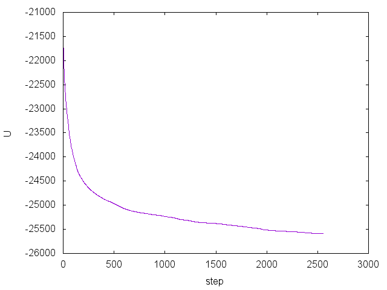
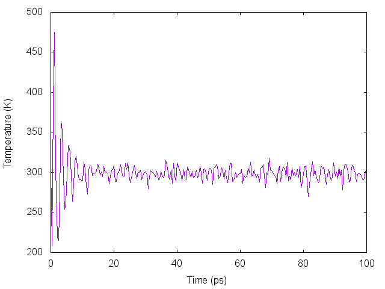
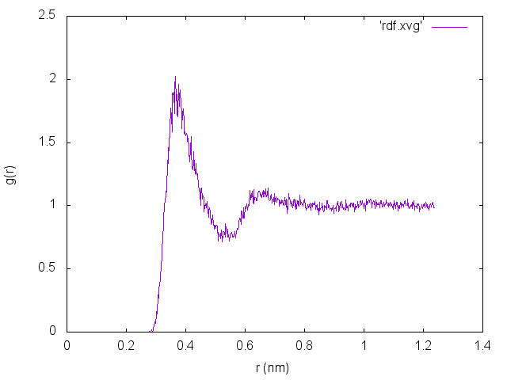

1. Methane in Water (NVT)
=========================

This tutorials shows how to setup and run a simple
GROMACS simulation, using one methane molecule in tip4p water. I'll show you how
to create the molecule and use *gmx pdb2gmx* to get the needed .gro and .top
files for the simulation. Additionally we'll solvate the simulation box. Lastly,
we'll run the simulation in three steps.

Setup residues for pdb2gmx
--------------------------

For this molecule we'll be using the OPLS force field. The force field is
located the `oplsaa.ff/` subdirectory of the root force field folder. Most
likely it is located somewhere like `/usr/share/gromacs/top`.

Let's take a look at its contents by going to the folder using `cd` and then
listing the directory contents:

	$ cd /usr/share/gromacs/top/oplsaa.ff
	$ ls

You'll see several files, but we're only interested in a few of them
for now.  Notice `forcefield.itp`. This is the main file used in
simulations. Inside you'll see a `[ defaults ]` section as well as the
inclusion of two other files - one for bonded interactions and one for
non-bonded interactions. We're also interested in `atomtypes.atp`
which gives the descriptions for the cryptic `opls_####` terms as well
as the `aminoacids.rtp` which give a list of recognized residues used
for the *gmx pdb2gmx* command.

Open `atomtypes.atp` with your text editor:

	$ vim atomtypes.atp

Go to the line with `opls_138`. Notice the comment says `alkane CH4`,
so we are on the right track here for our methane. However, notice the
mass in the second column - this is only the carbon for a CH4 group,
so we also need the hydrogens. This is an "all atom" model - every
atom is represented.  The corresponding hydrogen is `opls_140`. You'll
probably also want to look at the [supporting info of the OPLS force
field
paper](http://pubs.acs.org/doi/suppl/10.1021/ja9621760/suppl_file/ja11225.pdf).
The parameters in the paper should match up with the parameters that
we'll look at in a minute. Now make a note of these two atom types and
close the file.

Let's take a look at `ffnonbonded.itp` for these two atom types:

	$ grep opls_138 ffnonbonded.itp
	$ grep opls_140 ffnonbonded.itp

Here we see the name of the atom type, the bond type, the mass, the
charge, ptype, sigma, and epsilon. Make a note of the charge for each
one - we'll need it for our new residue. As a side note,
`ffbonded.itp` will use the bond type for the bond types, angle types,
and dihedral types.

Before continuing, you may want to copy your forcefield  directory
somewhere, like your home directory, since we'll be modifying it and
adding some files. To copy it to your home directory do: 

	$ cp -r /usr/share/gromacs/top $HOME/GMXLIB

You might have to be root to do it. Now change the `$GMXLIB`
environmental variable to:

	$ export GMXLIB=$HOME/GMXLIB

Add the above to your `.bash_profile` to make it permanent. Now do:

	$ cd $GMXLIB

You are now in the copy of the director you made, and all simulations
will use that directory instead of the one provided in the GROMACS
default directory.

Now open `aminoacids.rtp`. You'll notice several residues already in
the file.  We're going to add a new file called `methane.rtp` for our
methane with a residue that we'll call `CH4`. Close `aminoacids.rtp`.
We'll need to tell *gmx pdb2gmx* the atoms and bonds in the atom in
our residue file. We could also tell it the angles, but we'll leave
them out, since *gmx pdb2gmx* will figure it out for us. You should
create [a file that looks like
this](methane.rtp).  

A few notes on the above file: the `[ bondedtypes ]` comes from
`aminoacids.rtp` and is required.  Under `[ atoms ]` you can name them
anything you want, as long as they match the pdb file we are going to
create later.  Notice in the first column we gave the atom names, then
we gave the atom types, the charges, and then the charge group. Under
`[ bonds ]` we just tell it how each atom is connected to the others.
In this case, `CT1` has a connection to each hydrogen. We could
optionally add `[ angles ]`, but as stated earlier, GROMACS will sort
this out for us. Now close the file. See section 5.6 in the manual for more
information about this.

Create pdb file and run pdb2gmx
-------------------------------

Now we are ready to create the pdb file. There are several programs
out there to create molecule structure files.
[Avogadro](http://avogadro.cc/wiki/Main_Page) is one of those. An alternative
to this is to use *xleap* from the [AmberTools](http://ambermd.org/#AmberTools)
package. In Avogadro simply click any spot in the window and you'll get a
methane. Save this file as `methane.pdb`. Your file should look something like
[this](methane.pdb).  Save this somewhere in your home directory but not
anywhere in `$GMXLIB`.

Change `LIG` to `CH4` everywhere in `methane.pdb`. Also change `C` to
`CT1`, the first `H` to `HC1`, and so on. PDB files are fixed format,
so keep the beginning of each column in the same place. Also go ahead
and change `UNNAMED` to `Methane`. You can also delete the CONNECT
records, since they are not needed. Your modified file should look
[something like this](methane-1.pdb). Save the file as
`methane-1.pdb`.

Now we can use *gmx pdb2gmx* to create GROMACS .conf and .top files:

	$ gmx pdb2gmx -f methane-1.pdb

You'll be prompted to choose a force field. Choose OPLS. For the water
model just choose TIP4P for now. Three files will be created:
conf.gro, posre.itp, and topol.top. conf.gro is our coordinate file,
topol.top is the system topology file, and posre.itp is the optional
position restraint file. We won't be using that one. In the topol.top
file notice that there is an `[ angles ]` section as promised. You'll
also want to rename the compound in topol.top. Take a look and explore each
file. Chapter 5 of the GROMACS manual will help you understand the topology
file more.

Solvate system
--------------

Now let's go ahead and solvate the methane molecule with tip4p water:

	$ gmx solvate -cp conf.gro -o conf.gro -cs tip4p -p topol.top -box 2.5 2.5 2.5

The above solvates the one methane molecule with enough tip4p water to
fill up 2.5 x 2.5 x 2.5 nm box. Now notice in topol.top that there is
a new line added to the end with all of the waters. conf.gro will also
now have the positions of all of these waters.

If you want to visualize what the system looks like, you can use a
program called [vmd](https://www-s.ks.uiuc.edu/Research/vmd/). Once
you have vmd installed, do the following:

	$ vmd conf.gro

You'll see a box of water. It may be difficult to see where the
methane is, but there are ways to adjust the view to make things more
clear. Your methane might look like it is outside of the box. That's okay,
because we're using a periodic boundary condition.

Energy Minimization
-------------------

Now we're ready to do a simulation. A simulation
usually consists of three parts - minimization, equilibration, and
production.  The equilibration part can actually take several
different steps, depending on what ensemble you are operating in. The
production step can also have multiple steps. For this simulation
we'll simply be operating in the canonical ensemble (constant number
of molecules, volume, and temperature).

First, let's minimize the system's energy. [Here is a simple mdp file for
this.](min.mdp)
This just tells GROMACS to use the steepest-descent algorithm for
minimization, how many steps to go, etc. There are several values that
are not set that are the default values.  For example, we are not
setting the force to converge to (it is set to 10). You can read more
about the various mdp options
[here](http://manual.gromacs.org/online/mdp_opt.html). Minimization is
necessary since we want a good starting configuration that is close to
equilibrium, among other things.

Now that we have the .mdp file, we first need to preprocess the input:

	$ gmx grompp -f min.mdp -c conf.gro -p topol.top -o min -po minout.mdp

You'll now have a new file called `min.tpr`. This is needed for the simulation.
Also notice that a file named `minout.mdp` was created (with the `-po` flag). This
lists every single option available and the settings that were used. Most of
these are not relevant for energy minimization. Now let's run the energy
minimization step:

	$ gmx mdrun -deffnm min &

Notice I simply used the flag `-deffnm`. This means that all output files will
start with `min`. You can alternatively specify each option. If you want to see
all of the options for any of the Gromacs routines simply add the `-h` flag to
the command. Also notice the `&` at the end. This puts the program in the
background so that I don't accidentally kill it.

If you want to follow along with the simulation you can use `tail -f min.log` to
view the log file as it is updated. To stop following it hit `CTRL+c` to kill
tail.

After the minimization is finished, let's take a look at a few things. First,
let's look at the potential energy using `gmx energy`.

	$ gmx energy -f min.edr -xvg none -o minenergy.xvg

This reads in the energy file `min.edr` and gives us different variables we may
be interested in. Additionally `-xvg none` tells it not to format for a specific
graphing program. In the menu type the number corresponding with `Potential` and
hit enter. Then hit enter again to end the program. A new file was created
called `energy.xvg`, which records the potential energy as a function of type.

To plot it using [gnuplot](http://www.gnuplot.info/), first open
gnuplot and then type the following in the gnuplot prompt:

    $ gnuplot
	> plot 'minenergy.xvg' w l 

Your plot should look something like this:

Equilibration
-------------

Now it's time to equilibrate the system. We need another .mdp file for this
step. [Here is the file we'll be
using.](eql.mdp) Notice a few
things: the integrator is now "md", which is the default leap-frog
integrator.  The time step is 2 fs, and the number of steps
corresponds to a total simulation time of 100 ps. In the next section
of the file are several items telling GROMACS how often to output
certain files. In the third section notice we are telling GROMACS this
is not a continuation of another simulation, use the LINCS constraint
algorithm, and only constrain the hydrogen bonds. We will be
generating velocities corresponding to a 298.15 K temperature. Also note
we are using a temperature coupling at 298.15 K. For more information on
all of these options check out the mdp options page.

Notice that I am setting the cutoffs to 1.0 nm. Generally you should
check the article on the force field's parameterization to see what
cutoffs were used when the force field was designed. For the original
OPLS it was parameterized for 1.3 to 1.5 nm depending on the molecule
type. For this tutorial I wanted to be able to make the box a little
bit smaller, which is why I'm using 1.0 nm. It's up to you decide a
logical cutoff based on your research and applications.

Now using this .mdp file do:

	$ gmx grompp -f eql.mdp -c min.gro -p topol.top -o eql -po eqlout.mdp

Note that we are changing the configuration file to be the one from the energy
minimization step. Now run the equilibration step:

	$ gmx mdrun -deffnm eql &

Now let's just take a look at the temperature to see if it's equilibrated:

	$ gmx energy -f eql.edr -xvg none -o eqltemp.xvg

Select the number corresponding to `Temperature` and press enter twice. You'll
notice that the average temperature is around 298.15 K, which is what we wanted.
Now plot the temperature inside gnuplot with:

	> plot 'eqltemp.xvg' w l 

Notice that at the beginning it fluctuates wildly and then begins to steady out
around 298.15 K. It should look something like this:

Note that this equilibration is pretty short (100 ps), but we are dealing with a
very small system.

Production
----------

Now we're ready for the production run. We'll be using essentially the
same .mdp file but with two major changes - 1. We will not be
generating velocities, and 2. We will tell GROMACS that this is a
continuation of a previous simulation.  You can get the mdp file
[here](prd.mdp).  Additionally the sampling rate for the energy and coordinates
has changed and the simulation is now 10 ns.  

	$ gmx grompp -f prd.mdp -c eql.gro -p topol.top -o prd -po prdout.mdp
	$ gmx mdrun -deffnm prd & 

Just for fun let's look at a few attributes of the system. First,
let's again look at the temperature:

	$ gmx energy -f prd.edr -o prdtemp.xvg -xvg none 

The temperature will be very steady and won't show a big oscillation at the
beginning like in the equilibration step.

Now let's look at the radial distribution function. First we need to create an
index file so that we have the proper groups available for when we call `gmx rdf`:

	$ gmx make_ndx -f prd.gro 

You will now be entered into the *gmx make_ndx* prompt to select, delete, and
group together residues, atoms, etc. For us let's simply create a new index
group for the water oxygen atoms and the carbon on the methane. Enter the
following:

	> a CT1
	> a OW
	> q

The index file is saved as index.ndx. Now let's call *gmx rdf* to calculate the
radial distribution function:

	$ gmx rdf -f prd.xtc -n index.ndx -xvg none

You'll be prompted to select two groups. Select `CT1` and `OW`. You'll now have
an output file named `rdf.xvg`. When plotted it should look almost exactly like
this:

You could also create groups corresponding to the hydrogens on the waters and
plot those as well.

Summary
-------

In this tutorial we showed how to run a constant volume, constant temperature
simulation with one OPLS methane solvated in TIP4P water. Running the simulation
itself is not difficult - it's all in the set up. If you find out through working
through this tutorial there is a mistake or something doesn't work quite right,
please let me know.
