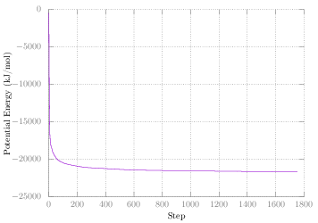
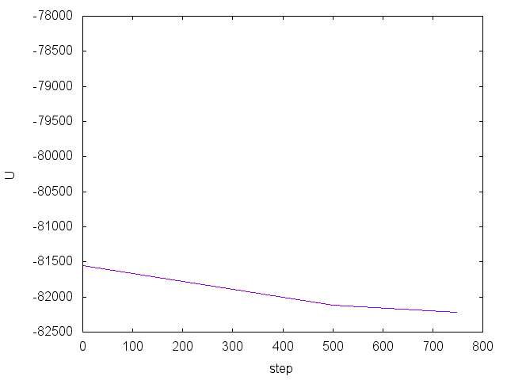
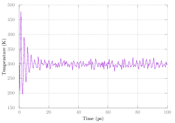
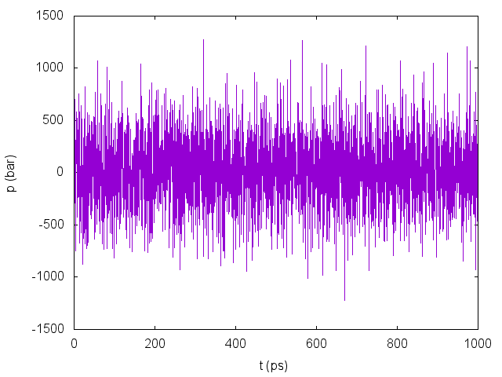

Tip4pEW Water
=============

In this introductory tutorial, I'll show you how to create a box of water and
run a simple simulation on it. At the end we'll find out the density of water.

Setup
-----

Every GROMACS simulations needs three essential files: structure (.gro/.pdb),
topology (.top), and parameters (.mdp). The structure file contains the
Cartesian coordinates of every atomic site in the system. The topology file
contains information on how each atomic site interacts with other atomic sites,
whether that is in non-bonded interactions or bonded interactions. This
information is provided by the force field. Non-bonded interactions included van
der Waals interactions and Coulomb interactions. Bonded interactions include
bonds, angles, and dihedrals. The parameters file includes information on how
long to run the simulation, the timestep, temperature and pressure coupling,
etc.

At this point I would suggest creating a directory to store files for this
tutorial:

	mkdir TIP4PEW
	cd TIP4PEW

### Topology file

We'll start with the topology file. Typically a topology file uses an `#include`
statement to include the force field to be used. This force field includes `[
atomtypes ]`, `[ bondtypes ]`, `[ angletypes ]`, and `[ dihedraltypes ]`
directives. Then in the topology file usually we specify different `[
moleculetype ]` directives which contain `[ atoms ]`, `[ bonds ]`, and `[
dihedrals ]` which refer back to the force field. Don't worry about this too
much right now. Water models include all of these for use.

Create a file named `topol.top` with the following text:

	#include "oplsaa.ff/forcefield.itp"
	#include "oplsaa.ff/tip4pew.itp"

	[ System ]
	TIP4PEW

	[ Molecules ] 

As you can see we've included the force field for OPLS-AA. Additionally we've
included the Tip4pEW water model. After this you'll see a `[ System ]` directive,
which includes just the name of the system, which can be anything you want.
Lastly, we list out each `moleculetype` and how many there are under `[
Molecules ]`. Right now we don't have any (we'll get those in a minute).

### Structure file

The structure of Tip4pEW is already provided by GROMACS in the topology
directory. This standard location is typically `/usr/lib/gromacs/top`, but you
my have it installed in a different directory. In that directory you'll see
several `.gro` files, one of which is `tip4p.gro`. You'll also see the folder
`oplsaa.ff` which we've included in our topology file above. There isn't a
structure file specific to Tip4pEW. Four-point water structure is essentially
the same for Tip4p and Tip4pEW. What makes them different is the force field
parameters.

To create a box of water using that structure file do:

	gmx solvate -cs tip4p -o conf.gro -box 3.5 3.5 3.5 -p topol.top

If you open back up `topol.top` you'll see that a line has been added at the
end with the word `SOL` and number. `SOL` is the name of the `moleculetype` that
is defined in `oplsaa.ff/tip4pew.itp`. When we ran _gmx solvate_, GROMACS added
enough water molecules to fill a box 3.5 nm in each direction.

### Parameter files

Now we need a set of parameter files so that GROMACS knows what to do with our
starting structure. Simulations almost always have three main parts:
minimization, equilibration, and production. Minimization and equilibration can
be broken down into multiple steps. Each of these needs it's own parameters
file. In this case we'll be doing two minimizations, two equilibrations, and one
production run.

Here are the files we'll be using:

* [Minimization](mdp/min.mdp)
* [Minimization 2](mdp/min2.mdp)
* [Equilibration](mdp/eql.mdp)
* [Equilibration 2](mdp/eql2.mdp)
* [Production](mdp/prd.mdp)

Create a folder in the `TIP4PEW` directory named `mdp` and download and store
the files there.

There will be a few things common to all five of our files:

|  parameter     | value     | explanation |
| ---------------|-----------|-------------| 
|  cutoff-scheme | Verlet    | This is now the default, but we provide it here in order to avoid any notes. _Generate a pair list with buffering._ |
|  coulombtype   | PME       | Use Particle-Mesh Ewald for long-range (k-space) electrostatics |
|  rcoulomb      | 1.0       | Cut-off for real/k-space for PME (nm). |
|  vdwtype       | Cut-off   | van der Walls forces cut-off at `rvdw` |
|  rvdw          | 1.0       | Cut-off for VDW (nm). |
|  DispCorr      | EnerPress | _apply long range dispersion corrections for Energy and Pressure_|

Cut-off distances should be set keeping in mind how the force field was
parameterized. We've chosen 1.0 nm for our cut-offs here, but you may determine
for your system to choose something else.

Additionally in each part we'll also be outputting an energy file, a log file,
and a compressed trajectory file. The rate of output (in simulation steps) for
these is set using `nstenergy`, `nstlog`, and `nstxout-compressed`,
respectively. We'll output more information in the production run.

For each part, except for the second minimization, we'll also be constraining
all bonds involving a hydrogen using the LINCS algorithm by setting
`constraint-algorithm = lincs` and `constraints = h-bonds`. This allows us to use
a larger time step than otherwise. 

For the first minimization we use the steepest descents algorithm by setting
`integrator = steep` to minimize the energy of the system with a maximum of
50,000 steps (`nsteps = 50000`). The minimization will stop if the energy
converges before then. The second minimization we are simply using another
(slower) algorithm by setting `integrator = l-bfgs`. This probably isn't
required in most cases, but I personally like to have these two steps to ensure
that my system has a good starting structure. This algorithm does not support
constraints, which is why they are turned off. Additionally we have `define =
-DFLEXIBLE`. This lets GROMACS know to use flexible water, since by default all
water models are rigid.

The last three steps all use the leap-frog integrator by setting `integrator =
md`. Additionally each one will use a 2 fs time step by setting `dt = 0.002`.

For the first equilibration step there are a few things to note. We are adding
several parameters shown below:

|  parameter     | value       | explanation |
| ---------------|-------------|-------------| 
| gen-vel        | yes         | Generate velocities for each atomic site according to a Maxwell-Boltzmann distribution. **Only generate velocities for your first equilibration step**. This gets us close to the temperature at which we will couple the system.        |
| gen-temp       | 298.15      |  Temperature in K to use for `gen-vel`.       |
| tcoupl         | Nose-Hoover |  The algorithm to use for temperature coupling. Nose-Hoover correctly produces the canonical ensemble.       |
| tc-grps        | System      | Which groups to couple. You can couple different groups of atoms separately, but we'll just couple the whole system. |
| tau-t          | 2.0         | Time constant for coupling. See the manual for details |
| ref-t          | 298.15      | The temperature in K at which to couple. |
| nhchainlength  | 1           | Leap-frog integrator only supports 1, but by default this is 10. This is set so we don't get a message later. |

The point of this first equilibration is to get use to the correct temperature
(298.15 K) before adding pressure coupling. We have set `nsteps = 50000`, so
with a 2 fs timestep, that means that this will run for 100 ps.

The second equilibration adds pressure coupling. Note that we are _not_
generating velocities again, since that will undo some of the work we just did.
We also set `continuation = yes` for the constraints, since we are continuing
the simulation from the first equilibration. This part will run for 1 ns.

|  parameter       | value       | explanation |
| -----------------|-------------|-------------| 
| pcoupl           | Parrinello-Rahman |  The algorithm to use for pressure coupling.  Parrinello-Rahman correctly produces the isobaric-isothermal ensemble when used with Nose-Hoover.       |
| tau-p            | 2.0         | Time constant for coupling. See the manual for details |
| ref-p            | 1.0         | The pressure in bar at which to couple. |
| compressibility  | 4.46e-5     | The compressibility of the system in bar^-1.  |

For the production run, everything is exactly the same as the last
equilibration, except we are outputting more data and running for 10 ns.

Simulation
----------

Phew. We have all the files we need now to run each part of the simulation. Each
part you typically run *gmx grompp* to preprocess the three files we now have
(.gro, .top, and .mdp) into a .tpr file (sometimes confusingly also called a
topology file).

### Minmizations

First, let's run our two minimization steps by doing the following:

	gmx grompp -f mdp/min.mdp -o min -pp min -po min
	gmx mdrun -deffnm min

	gmx grompp -f mdp/min2.mdp -o min2 -pp min2 -po min2 -c min -t min -maxwarn 1
	gmx mdrun -deffnm min2
	
At each part we are reading in the .mdp file with the `-f` flag. By default if
`-c` and `-p` flags are not specified GROMACS uses `conf.gro` and `topol.top`
for the structure and topology files. Additionally we are outputting a process
topology file `-pp` and mdp file `-po`. These are optional, but probably worth
looking at, especially the processed mdp file, since it is commented.

At each subsequent step we read in the previous step's last structure file or
checkpoint file using the `-c` and `-t` flags. If the checkpoint file is not
present, GROMACS will use the structure file, so it is a good practice to
specify both. At each *gmx mdrun* we are telling GROMACS to use a default name
for each input and output file, since several files are output.

Note we are using `-maxwarn 1` for the second minimization. Only use this flag
if you know what you are doing! In this case we get a warning about the
efficiency of L-BFGS which we can safely bypass.

To get a feel for what's going on, let's extract the potential energy of both of
these parts using the GROMACS command *gmx energy*. Do the following and enter
the number that corresponds with `Potential`, followed by enter again:

	gmx energy -f min.edr -o min-energy.xvg -xvg none

Now do the same for the second minimization:

	gmx energy -f min2.edr -o min2-energy.xvg -xvg none

We use `-xvg none` since by default GROMACS outputs these files in a format for
the Grace plotting software. In this tutorial I'll be using gnuplot. To plot
with first start gnuplot:

	gnuplot

Then in the gnuplot terminal do:

	plot 'min-energy.xvg' w l

To plot the second minimization step do:

	plot 'min2-energy.xvg' w l

Your plots should looks something like this:

### Equilibration 1 (NVT)

Now that we have a good starting structure, let's do the first equilibration
step, by adding the temperature coupling:

	gmx grompp -f mdp/eql.mdp -o eql -pp eql -po eql -c min2 -t min2
	gmx mdrun -deffnm eql

Let's take a look at how the temperature varies throughout the simulation:

	gmx energy -f eql.edr -o eql-temp.xvg -xvg none

Choose the number corresponding to `Temperature` at the prompt and hit enter
again. Plot it in gnuplot as above. You should see something like:

Note that initially the temperature initially fluctuates wildly but eventually
settles.

### Equilibration 2 (NPT)

For our last equilibration, as stated earlier, we're adding a pressure coupling:

	gmx grompp -f mdp/eql2.mdp -o eql2 -pp eql2 -po eql2 -c eql -t eql
	gmx mdrun -deffnm eql2

You can check out the temperature and pressure using *gmx energy* as above.
Here's a plot of the pressure:

Note that pressure fluctuates quite a bit, which is normal. The average after
full equilibration should be close to 1 bar in this case.

### Production

Now for the production part do:

	gmx grompp -f mdp/prd.mdp -o prd -pp prd -po prd -c eql2 -t eql2
	gmx mdrun -deffnm prd

Analysis
--------

Using *gmx energy* as above, get the average temperature, pressure, and density.
Are they what you expect?
